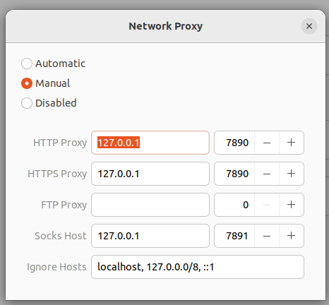

# 1.1
1. 完成window11密码重置

忘记windows密码后，成功修改windows密码

    - 在开机界面，点击右下角的图标，出现cmd命令行，将c:\windows\system32\utilman.exe进行备份，在将cmd.exe复制为utilman.exe, 重启，也可以不重启（为了让让系统执行假的utilman.exe）
    - 修改密码
        - net localgroup administrators
        - net user 用户名 * ： 进行用户名密码修改
        - 注销当前用户输入刚才输入的密码，就可以进入系统了
        - 恢复原先的utilman.exe,仍然在开机界面进入cmd界面，将utilman.exe.bak覆盖为utlman.exe 
            - copy utilman.exe.bak utilman.exe /y
2. 完成linux下代码无法使用的问题

更新nthu.cc的新订阅内容

    在windows中，先启动clash，然后访问www.nthu.cc获取最新的订阅地址，并更新，获取，更新后的：config.yaml， Country.mmdb和cache.db，其中最新的config.yaml在profiles文件夹下，将其最新的yaml文件的名字改为config.yaml

    将获得以上三个文件，放在在ubuntu的~/.config/clash/下之前，先清空该文件内容，并重启clash以便获得默认值，之后再完全覆盖

    在.bashrc或.zshrc中输入：
    export http_proxy='http://127.0.0.1:7890'
    export https_proxy='http://127.0.0.1:7890'

    当启动clash之后，在代理中设置如下信息：, 即可完成代理设置。

3. 完成将本地的ros_ws的内容放到自己的额github上，并实现与本地关联

4. 完成将URDF模型（机器人模型）在rviz2中的展现

10. 导航的配置、参数调整和应用开发
    - 项目：自动巡检机器人
        - 基于仿真和导航，做了一个在各个房间不断巡逻并记录图像的机器人

